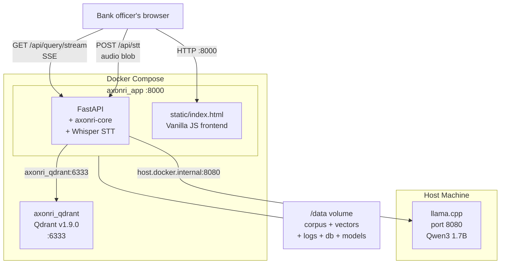

# axonri-banking

**The Axonri banking compliance product — ships to customers.**

This repo is the runnable application. It wraps `axonri-core` with
everything specific to Indian banking regulation: RBI documents,
UCB-specific prompts, admin panel, Docker deployment.

> **Status: FROZEN for now.**
> Do not make changes here until axonri-core eval accuracy > 75%.
> The pipeline runs end-to-end but accuracy is 0%.
> See axonri-core/STATUS.md for root cause.

---

## What this repo contains

```
axonri-banking/
├── app/
│   ├── main.py           # FastAPI startup (10-step sequence)
│   ├── domain_config.py  # THE banking file — all RBI-specific config
│   ├── database.py       # SQLite + WAL mode
│   └── routers/
│       ├── query.py      # SSE streaming endpoint
│       ├── health.py     # GET /api/health
│       ├── stt.py        # Whisper STT endpoint
│       ├── documents.py  # Document management
│       ├── admin.py      # Query logs, admin panel
│       └── auth.py       # Login / session
├── scripts/
│   ├── download_corpus.py  # Downloads RBI PDFs from rbi.org.in
│   ├── ingest.py           # Runs ingestion pipeline on corpus
│   └── network_check.py    # Diagnoses Docker → host LLM connectivity
├── static/
│   └── index.html          # Full frontend (vanilla JS, no framework)
├── docker-compose.yml      # Development (--reload, source mount)
├── docker-compose.prod.yml # Production (no reload, --workers 1)
└── Dockerfile              # Builds the app container
```

---

## Architecture



---

## Quick start

### Prerequisites
- Docker + Docker Compose installed
- llama.cpp server running on host port 8080
- `axonri-core` repo in sibling directory (`../axonri-core`)

### Start the stack

```bash
cd /data/axonri-workspace/axonri-banking

# Start Qdrant + app
docker compose up -d

# Check health
curl http://localhost:8000/api/health

# Download RBI documents (first time)
docker compose exec app python scripts/download_corpus.py --priority critical

# Ingest documents
docker compose exec app python scripts/ingest.py

# Open browser
http://localhost:8000
```

### Default credentials
- Username: `admin`
- Password: `axonri123` (change in docker-compose.yml before any real deployment)

---

## The one file that matters: domain_config.py

`app/domain_config.py` is the only file in this repo that makes this
a banking product. It contains:

1. `BANKING_SYSTEM_PROMPT` — instructs LLM to cite RBI documents
2. `banking_config` — a `DomainConfig` instance with all tuning params
3. `RBI_DOCUMENT_CORPUS` — list of 19 RBI document URLs

To deploy to a new bank, change nothing except environment variables.
To deploy to a new industry (pharma), create a new repo with a different
`domain_config.py`. Zero changes to axonri-core or axonri-banking code.

---

## RBI Document corpus

| Priority | Document | Status |
|---|---|---|
| Critical | UCB Credit Facilities Directions 2025 | ✅ Downloaded |
| Critical | UCB Credit Risk Management 2025 | ✅ Downloaded |
| Critical | UCB Prudential Norms 2025 | ✅ Downloaded |
| Critical | KYC Direction 2016 (Aug 2025) | ⚠️ Manual download needed |
| Critical | IRAC Master Circular NPA | ⚠️ Manual download needed |
| High | UCB Governance Directions 2025 | Not downloaded |
| High | UCB Frauds Classification 2025 | Not downloaded |
| High | Priority Sector Lending | ⚠️ Manual download needed |

Manual download URLs are in `app/domain_config.py` under `RBI_DOCUMENT_CORPUS`.

---

## Known issues (do not fix until axonri-core is stable)

1. **0% eval accuracy** — upstream issue in axonri-core parsing
2. **Auth bypass** — `/api/query/stream` and `/api/query` have hardcoded
   token bypass for eval runner (`"test"`, `"eval-runner"`). Remove before production.
3. **qdrant-client version warning** — client 1.18 vs server 1.9 mismatch.
   Functional but produces warnings.
4. **Think tags in answers** — Qwen3 leaks `<think>...</think>` tags.
   Fix is in axonri-core/llm.py.

---

## Startup sequence

When `docker compose up` runs, `app/main.py` executes these steps in order:

```
1.  Validate DomainConfig (banking_config.validate())
2.  Auto-detect LLM host (tries host.docker.internal, gateway, localhost)
3.  Load BGE-M3 embedding model (~30s first run, instant after)
4.  Load BGE-reranker model (currently passthrough)
5.  Load Whisper STT small model (~10s first run)
6.  Connect to Qdrant, ensure collection exists
7.  Load BM25 index from /data/vectors/bm25.pkl
8.  Init RAGEngine with banking_config
9.  Init SQLite database (create tables if needed)
10. Start health logging background task (every 60s)
```

If any step fails, the app exits with a clear error message.
